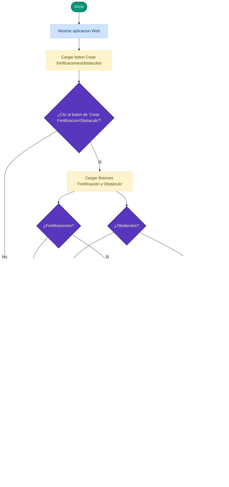
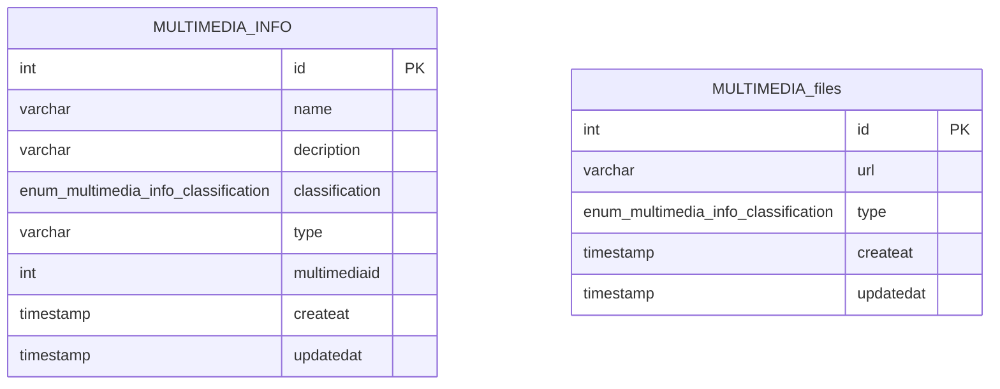

# Sistematización de Fortificaciones y Obstáculos (MTRR)
### 🇻🇪 UNEFA Falcón - Ingeniería de Sistemas

Este sistema automatiza y recopila las especificaciones técnicas de fortificaciones sobre el terreno, diseñado para un rol único de **Operador de Terreno / Cliente**.

---

## 📐 Arquitectura del Sistema (Mermaid.js)

### 🚀 1. Diagrama de flujo


### 📊 2. Modelo Entidad-Relación de la Base de Datos (PostgreSQL)


### 🚀 1. Diagrama de flujo
```mermaid
graph LR
    %% Configuración de Estilos Básicos
    classDef capa fill:#f9f9f9,stroke:#333,stroke-width:2px;
    classDef componente fill:#ffffff,stroke:#2196f3,stroke-width:1px,color:#000;
    classDef backend fill:#ffffff,stroke:#4caf50,stroke-width:1px,color:#000;
    classDef db fill:#ffffff,stroke:#1e3d59,stroke-width:1px,color:#000;

    %% --- CAPA FRONTEND ---
    subgraph Frontend ["Lado del Cliente (Frontend) - Interfaz MTRR"]
        Usuario((👤 Usuario))
        HTML["🌐 HTML5 (Lienzo del Mapa)"]
        CSS["🎨 CSS3 (Renderizado de Iconos)"]
        JS["⚡ JavaScript Fetch (Lógica y Capas)"]
        Marcadores["📍 Manejo de Marcadores"]
        UserInput["⌨️ User-Input"]
    end

    %% --- CAPA BACKEND ---
    subgraph Backend ["Lado del Servidor (Backend) - Express.js"]
        Rutas["🛣️ Rutas (/api/multimedia)"]
        Middleware["🛡️ Middleware (Autenticación/Cuerpo)"]
        Controllers["🧠 Controllers (Lógica de Negocio)"]
        Sequelize["🔄 ORM Sequelize (Modelos y Mapeo)"]
    end

    %% --- CAPA BASE DE DATOS ---
    subgraph Database ["Base de Datos (PostgreSQL)"]
        Catalogo["📚 Catálogo Recursos Tácticos"]
        Relacion{{"1:N Relación"}}
        Activos["🎬 Almacenamiento Activos Visuales"]
    end

    %% --- ASIGNACIÓN DE ESTILOS POR CLASES ---
    class HTML,CSS,JS,Marcadores,UserInput componente;
    class Rutas,Middleware,Controllers,Sequelize backend;
    class Catalogo,Activos db;

    %% --- FLUJOS DE ENTRADA Y PETICIONES ---
    Usuario --> UserInput
    Usuario --> Marcadores
    UserInput & Marcadores --> JS
    
    %% Petición HTTP del Frontend al Backend
    JS -->| "Peticiones HTTP (JSON)" | Rutas
    Rutas --> Middleware
    Middleware --> Controllers
    Controllers --> Sequelize

    %% Comunicación Backend ↔ Database
    Sequelize <-->| "Consultas SQL / JSON" | Catalogo
    Catalogo --> Relacion
    Relacion --> Activos

    %% Flujo de respuesta final (Cierre del ciclo)
    Sequelize -.->| "Respuestas HTTP (JSON)" | JS
    Activos -.->| "Flujo de Datos Multimedia (Animación)" | HTML
```