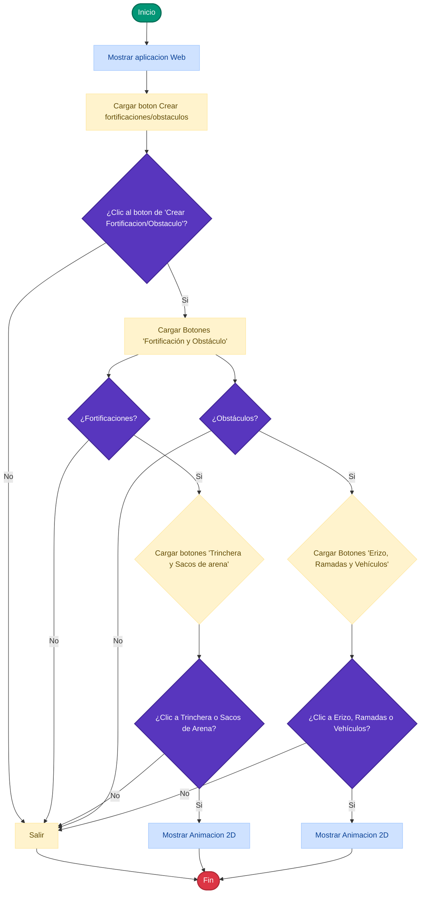
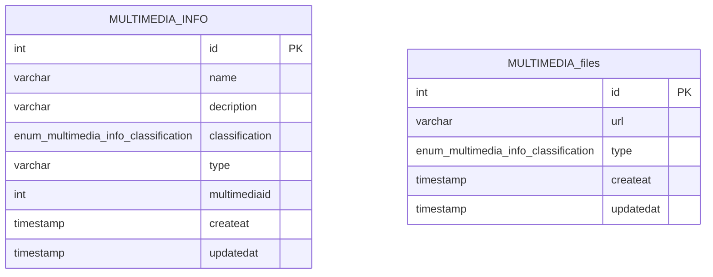
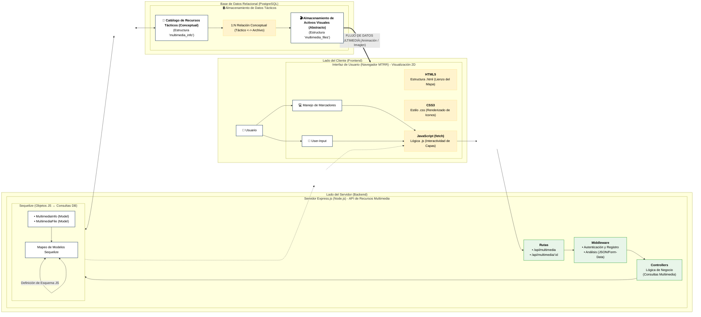

# Sistematización de Fortificaciones y Obstáculos (MTRR)
### 🇻🇪 UNEFA Falcón - Ingeniería de Sistemas

Este sistema automatiza y recopila las especificaciones técnicas de fortificaciones sobre el terreno, diseñado para un rol único de **Operador de Terreno / Cliente**.

---

## 📐 Arquitectura del Sistema (Mermaid.js)

### 🚀 1. Diagrama de flujo

### 📊 2. Modelo Entidad-Relación de la Base de Datos (PostgreSQL)

### 🚀 1. Diagrama de arquitectura
